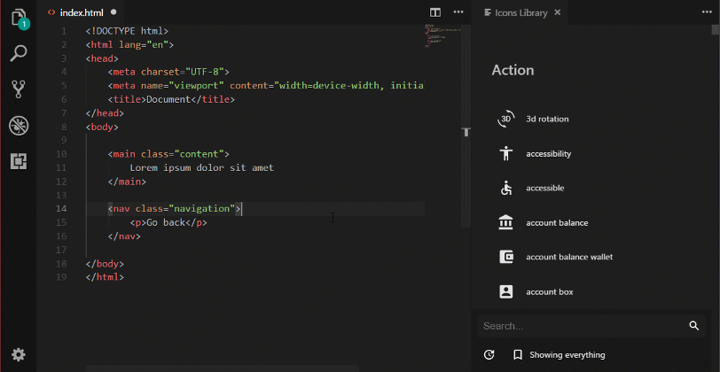

# Material Icons Library

A VSCode extension that let's you insert *Google's Material Design Icons* into your html code.

## Features

Minimalistic sidebar library which allows you to:
* Place icons in file
* Change existing icons
* Search by name
* Copy svgs directly to clipboard
* Add to your Bookmarks for quick access
* Download the latest pack from Google's repository

## Usage

Extension is activated by running `imageIcons.showLibrary` command. You can either:
* Press `ctrl+alt+i` to open it.
* Press `f1` or `ctrl+shift+p` and type `Show Icons Library`.

## Settings

* `material-icons.classList`: Defines classes which svgs will have after insertion
* `material-icons.includeXmlns`: Chooses whether to include the `xmlns` tag inside svgs

## Relesase Notes `[0.0.4] - 2018-05-23` 
### Added
- Button to copy icon source into clipboard
- Settings to:
    * define svg `classList`
    * enable `xmlns` attribute